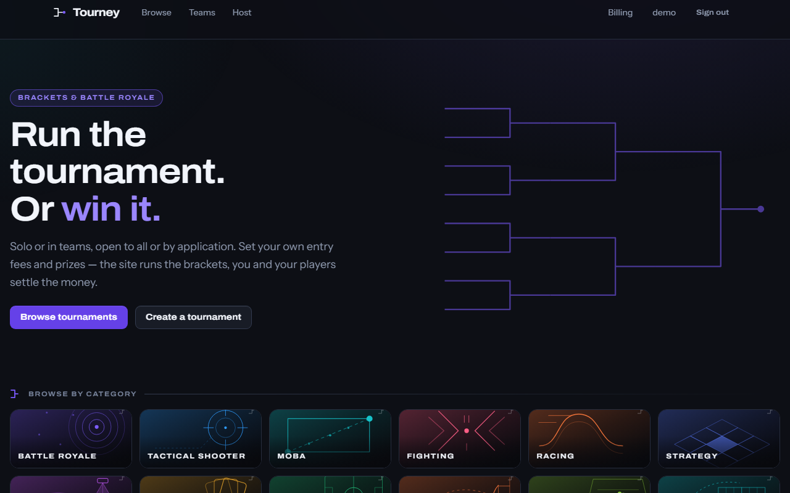
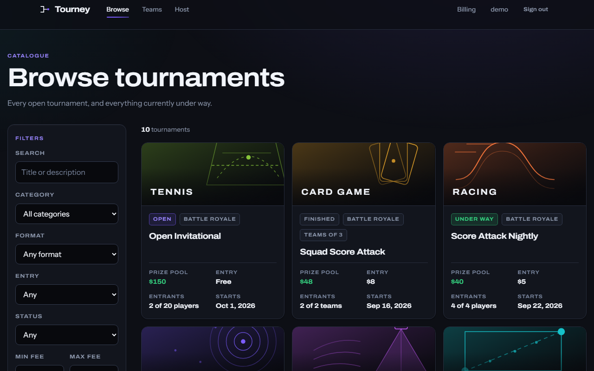
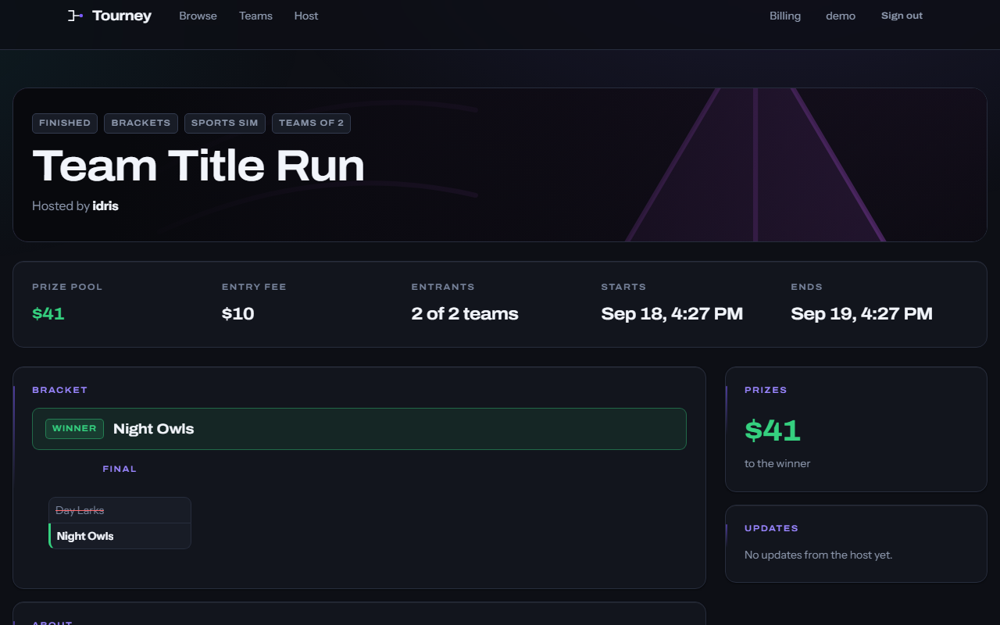
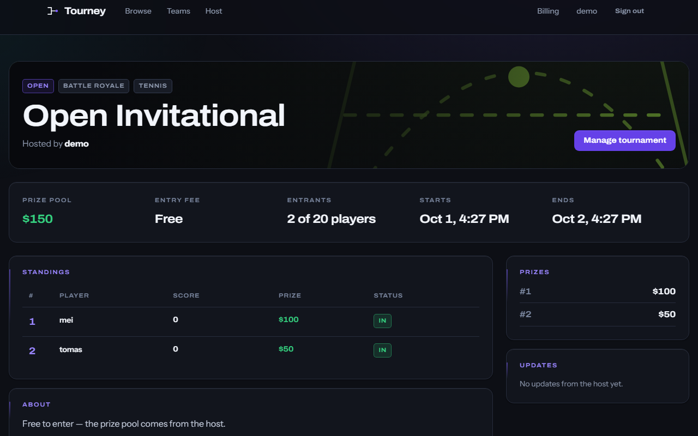
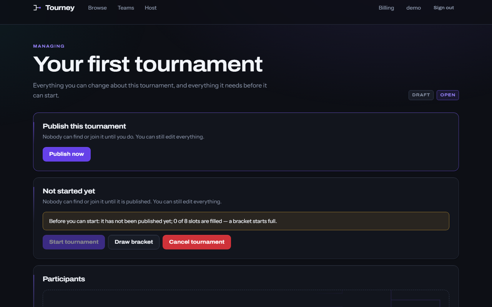
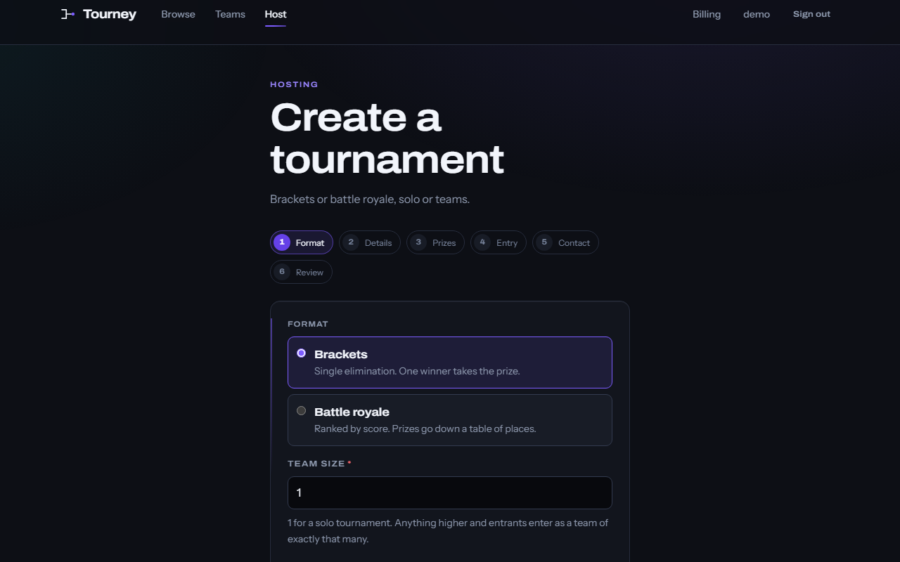
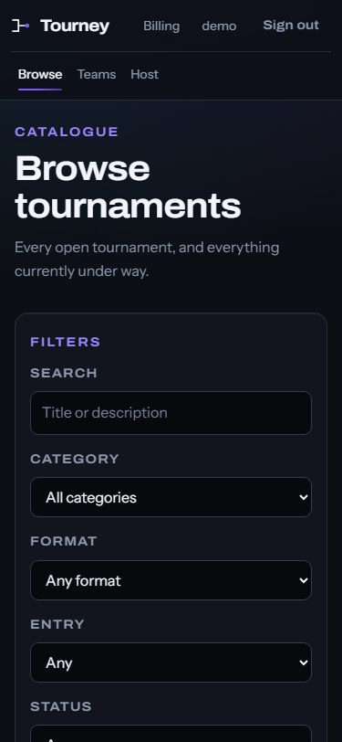
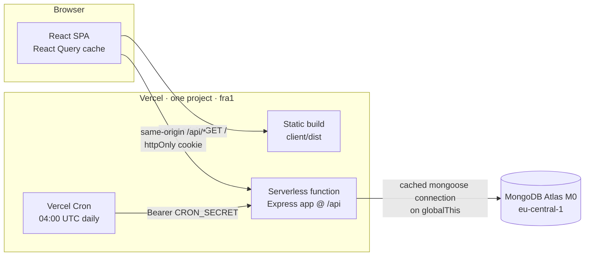

<div align="center">

<picture>
  <source media="(prefers-color-scheme: dark)" srcset="client/public/brand/tourney-logo-dark.svg">
  <source media="(prefers-color-scheme: light)" srcset="client/public/brand/tourney-logo-light.svg">
  
</picture>

### Run the tournament. Or win it.

Host and play grassroots tournaments — single-elimination brackets and
score-ranked battle royales, solo or in teams — with entry fees held in escrow
until the prizes are covered.

[](https://github.com/waleedhussein4/tourney/actions/workflows/ci.yml)
[](https://tourney-host.vercel.app)
[](LICENSE)


**[→ Open the live demo](https://tourney-host.vercel.app)**

</div>

---

## Try it

The demo is seeded with fourteen accounts, four teams, and ten tournaments in
every state — open, filling, under way, and finished.

> ### Sign in as
>
> **Email** `demo@tourney.app`
> **Password** `DemoPlayer2026`
>
> The account starts with 500 credits and is already a host, so you can enter a
> tournament _and_ run one. Every seeded player (`mei`, `tomas`, `ada`, `kofi`,
> `lena`, …, all `@tourney.app`) shares the password `Player2026Demo`, if you
> want a second pair of hands.
>
> **The demo data resets itself every day at 04:00 UTC** — so break things
> freely. Spend the credits, cancel the tournaments, kick people out of teams.
> It will all be back tomorrow.

Or sign up with a throwaway email; nothing is sent to it. The checkout is a
demonstration and is labelled as one everywhere it appears: no payment is
processed, and the card fields never leave your browser.

---

## Screenshots

|                                                                    |                                                                        |
| ------------------------------------------------------------------ | ---------------------------------------------------------------------- |
|                               |                          |
| **Home** — the bracket motif, and the thirteen category cards      | **Browse** — filters in the URL, so a filtered list is shareable       |
|                          |                    |
| **A bracket** — who advanced, who went out, what the bank holds    | **A battle royale** — score-ranked, with each rank's prize             |
|                          |                             |
| **The host console** — everything a host can change, in one screen | **Creating one** — six steps, with the bank forecast before you commit |

<div align="center">
  
  <br><em>Responsive down to 360px.</em>
</div>

---

## Features

### For players

- Browse every tournament as a guest — no account needed to look around.
- Filter by category, format, entry, status, and fee range. Filters live in the
  URL, so a filtered list can be linked to.
- Enter solo, or as a team, or apply with answers to the host's questions.
- Follow a live bracket, or a score-ranked leaderboard with each rank's prize.
- A credit ledger showing every credit that has moved in or out of the account.

### For hosts

- Become a host for a one-off 20 credits.
- Create a six-step tournament: format, details, prizes, entry, contact, review
  — with a running forecast of what the prize bank will still need.
- Review and accept or reject applications.
- Top the prize bank up, shuffle the bracket seeding, start it, record results
  round by round, and end it — payouts run automatically.
- Post updates that everyone watching the tournament sees.

### For teams

- Create a team, invite by link or six-character join code, promote a new
  leader, remove a member, or leave.
- The leader enters the team and pays the entry fee.
- A team that has entered a tournament is frozen until it finishes — nobody can
  leave, be removed, or dissolve it out from under the prize table.

### The credits economy

- Credits buy tournament entries, fund prize banks, and pay for the host
  upgrade. They arrive through a demo checkout.
- Entry fees are **escrowed** in a per-tournament bank.
- A tournament **cannot start until the bank covers the advertised prizes** —
  the host tops up the difference from their own balance.
- Payouts come out of that bank when the tournament ends.

---

## How it works



One Vercel project serves both halves from **one origin**. That is not a
deployment detail — it is why there is no CORS configuration anywhere in the
codebase, and why the auth cookie is first-party (`HttpOnly; SameSite=Lax;
Secure`) rather than a third-party cookie that Safari would drop on the floor.

The function is pinned to `fra1` to sit beside the Atlas cluster, because one
page load makes several database round trips and cross-region would put ~100 ms
on each of them.

### How the credits economy stays consistent

Every credit movement touches at least two documents — a wallet and a bank, or
two wallets — and writes a `Transaction` row describing the change. Those writes
run inside a **mongoose transaction**, so a half-applied entry fee is not a
state the database can be left in.

The invariant is that credits are _conserved_. There is exactly one source (the
demo checkout, which grants them) and one sink (the host upgrade fee, which
burns them). Every other operation only moves credits between wallets and banks,
so the total across every wallet and every bank must be unchanged by it.

[`server/tests/conservation.test.js`](server/tests/conservation.test.js) holds
that line, and it checks it two independent ways: it sums what the documents
say, and it sums what the ledger rows say, and requires them to agree. If a
balance write ever commits without its ledger row — or a row without its write —
the two measures diverge and the suite fails.

```
                buy credits                    host upgrade
                     │                              │
                     ▼                              ▼
   (source) ──▶ [ wallets ] ◀──── payout ──── [ banks ] ──▶ (sink)
                     └──────── entry fee ────────▶
```

---

## Tech stack

| Layer        | Choice                                       | Why                                                                        |
| ------------ | -------------------------------------------- | -------------------------------------------------------------------------- |
| Client       | React 18 + Vite 5, plain JSX                 | No build-time type layer to maintain; JSDoc where types help               |
| Routing      | react-router-dom 6                           | Filters and dialogs live in the URL                                        |
| Server state | TanStack Query 5                             | Caching and invalidation instead of manual refetch; zero full-page reloads |
| Forms        | react-hook-form 7                            | Uncontrolled inputs, validation next to the field                          |
| Styling      | CSS Modules + a token sheet                  | No runtime CSS-in-JS; see [docs/DESIGN.md](docs/DESIGN.md)                 |
| API          | Express 4 (ESM)                              | Runs unchanged as a Vercel serverless function                             |
| Validation   | zod 3                                        | Every `params`, `query`, and `body` validated before a controller runs     |
| Database     | MongoDB Atlas M0 + mongoose 8                | Transactions for every multi-document credit movement                      |
| Auth         | JWT in an `httpOnly` cookie                  | No token in `localStorage` for a script to read                            |
| Tests        | vitest 4 + supertest + mongodb-memory-server | 214 tests against a real replica set, not mocks                            |
| Hosting      | Vercel Hobby + Atlas M0                      | $0, and neither sleeps                                                     |

---

## Running it locally

```bash
git clone https://github.com/waleedhussein4/tourney.git
cd tourney
npm install

cp server/.env.example server/.env    # then set MONGODB_URI and JWT_SECRET
npm run seed                          # demo accounts, teams, tournaments
npm run dev                           # API on :2000, client on :5173
```

Open <http://localhost:5173>. The seed prints the demo credentials it created;
set `SEED_DEMO_PASSWORD` beforehand to choose your own.

You need a MongoDB connection string — a free Atlas M0 cluster or a local
`mongod`. Note that the credit tests and the seed use transactions, so a
standalone `mongod` will refuse them; use Atlas, or run a single-node replica
set locally. Full setup notes are in [docs/SETUP.md](docs/SETUP.md).

### The commands

|                             |                                             |
| --------------------------- | ------------------------------------------- |
| `npm run dev`               | API and client together                     |
| `npm test`                  | The server suite (214 tests)                |
| `npm run lint`              | ESLint across both workspaces               |
| `npm run build`             | Production client build                     |
| `npm run seed`              | Seed demo data (`-- --reset` to wipe first) |
| `npm run check:regressions` | Grep gates that keep old bugs dead          |

---

## Project structure

```
tourney/
├── api/index.js          the Vercel entrypoint — exports the Express app
├── client/               React 18 + Vite SPA
│   └── src/
│       ├── api/          one module per resource, all fetch in one place
│       ├── app/          providers and the route table
│       ├── components/   brand/ (logo, bracket motif, category art), layout/, ui/
│       ├── features/     one folder per feature, page + styles + queries
│       ├── lib/          formatting, rich text, small hooks
│       └── styles/       tokens.css and globals.css
├── server/               Express + Mongoose API
│   ├── scripts/          the seed, shared with the admin page
│   ├── src/
│   │   ├── config/       env validation, domain constants
│   │   ├── db/           the cached mongoose connection
│   │   ├── middleware/   auth, validation, rate limits, error handler
│   │   ├── models/       mongoose schemas
│   │   ├── modules/      routes + controller + service + zod schemas, per resource
│   │   └── utils/        ApiError, asyncHandler
│   └── tests/            vitest suites against a real replica set
└── docs/                 SETUP, API, ARCHITECTURE, DESIGN, DEPLOYMENT
```

Each server module is four files — `*.routes.js`, `*.controller.js`,
`*.service.js`, `*.schemas.js` — so a request's path through the code is the
same every time: route validates, controller shapes the response, service owns
the rules and the transaction.

---

## Documentation

|                                              |                                               |
| -------------------------------------------- | --------------------------------------------- |
| [docs/SETUP.md](docs/SETUP.md)               | Local development, in five commands           |
| [docs/API.md](docs/API.md)                   | Every endpoint: auth, body, response, errors  |
| [docs/ARCHITECTURE.md](docs/ARCHITECTURE.md) | The decisions, and what they cost             |
| [docs/DESIGN.md](docs/DESIGN.md)             | The design system and the reasoning behind it |
| [docs/DEPLOYMENT.md](docs/DEPLOYMENT.md)     | Vercel + Atlas, env vars, the daily reseed    |
| [CONTRIBUTING.md](CONTRIBUTING.md)           | Workflow, conventions, and the quality gates  |

---

## History and credits

**v1.0 (2024)** — Tourney began as a six-person university course project, split
across two repositories: a React frontend and an Express backend. It worked, it
was demoed, and it was graded.

**v2.0 (2026)** — This repository is a solo rewrite. Both original repositories
were merged into one monorepo **with their full commit histories intact** — 694
commits, and every original contributor still attributed in `git log` and in
GitHub's contributor list. Nothing was squashed away to make the rewrite look
like it started from nothing.

Everything above the history was then rebuilt: the server re-architected around
modules, zod validation, transactions and one error shape; the client rewritten
on React Query with no full-page reloads; a design system and original artwork
replacing hotlinked game imagery; a real test suite; and a $0 deployment.

### The original team

Contributors to v1.0, from `git shortlog` across both merged histories:

|                                                      |                                          |
| ---------------------------------------------------- | ---------------------------------------- |
| [@waleedhussein4](https://github.com/waleedhussein4) | frontend, backend — and the v2.0 rewrite |
| Haytham Duwaji                                       | backend                                  |
| [@jadzeid](https://github.com/jadzeid)               | frontend                                 |
| [@HamzaMatar15](https://github.com/HamzaMatar15)     | frontend                                 |
| [@JadElMurr](https://github.com/JadElMurr)           | frontend                                 |
| [@Soumi-7](https://github.com/Soumi-7)               | frontend                                 |

The two original repositories, `tourney-frontend` and `tourney-backend`, are
archived and point here.

---

## Roadmap

Honest about what is _not_ built:

- **Notifications** — nothing tells you that your application was accepted or
  that your match is up. It is the biggest gap.
- **Withdrawals** — credits go in and move around, but never come back out.
  That is deliberate for a demo economy, and it is also why the checkout is a
  demonstration.
- **Friends and profiles** — accounts have no public profile and no social
  graph.
- **Double elimination and group stages** — brackets are single elimination
  only.
- **Real payments** — out of scope; the demo checkout is labelled everywhere it
  appears.

---

## License

[MIT](LICENSE) — with a credits line for the original team, who wrote the
history this repository is built on.
