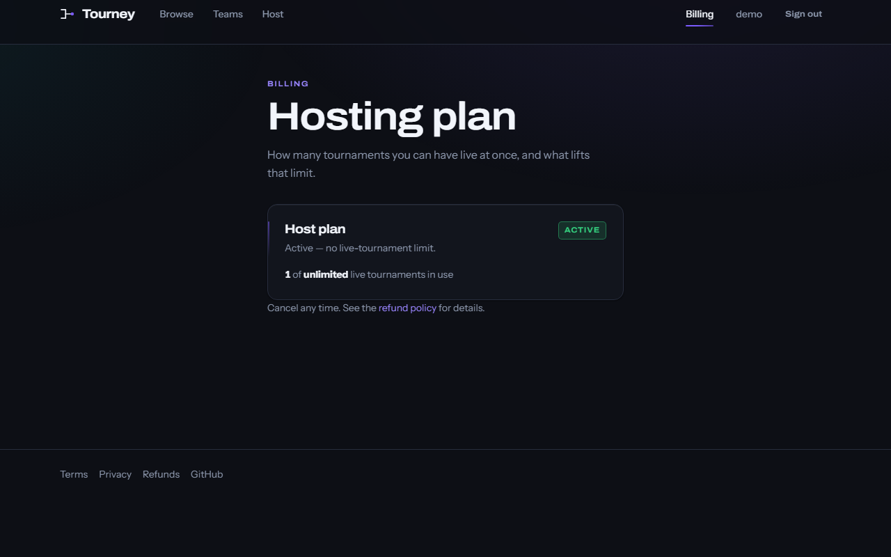

<div align="center">

<picture>
  <source media="(prefers-color-scheme: dark)" srcset="client/public/brand/tourney-logo-dark.svg">
  <source media="(prefers-color-scheme: light)" srcset="client/public/brand/tourney-logo-light.svg">
  
</picture>

### Run the tournament. Or win it.

Host and play grassroots tournaments — single-elimination brackets and
score-ranked battle royales, solo or in teams, open-join or application-gated.

[](https://github.com/waleedhussein4/tourney/actions/workflows/ci.yml)
[](https://tourneylb.com)
[](LICENSE)


**[→ Open the live demo](https://tourneylb.com)**

</div>

---

## Try it (60 seconds)

1. On the live demo, click **Use the demo account** (`demo@tourney.app` /
   `DemoPlayer2026`) instead of typing credentials.
2. Open **Your first tournament** from the profile menu.
3. Press **Publish**.

That's the whole loop — sign in, open a tournament you already host, put it
live. Everything else (brackets, teams, applications, standings) is reachable
from there.

Demo data resets daily at 04:00 UTC, so nothing you do sticks around — break
things freely.

---

## Screenshots

All below are from `docs/media/`; the same folder holds `docs/media/demo.gif`.

|                                                                      |                                                                    |
| --------------------------------------------------------------------- | --------------------------------------------------------------------- |
|                                  |                         |
| **Home** — the bracket motif, and the category cards                  | **Browse** — filters live in the URL, so a filtered list is shareable |
|                             |                   |
| **A bracket** — who advanced, who went out                            | **A battle royale** — score-ranked, with each rank's prize            |
|                             |                            |
| **The host console** — everything a host can change, in one screen    | **Creating one** — format, details, prizes, entry, review             |

<div align="center">
  
  <br><em>Responsive down to 360px.</em>
  <br><br>
  
</div>

---

## What it does

- **Hosts and players.** Anyone can browse as a guest; signing in lets you
  enter tournaments and, once subscribed, host them.
- **Two formats.** Single-elimination brackets, and score-ranked battle
  royales with per-rank standings.
- **Solo or teams.** Create a team, invite by link or join code, promote a new
  leader. A team that has entered a tournament is frozen until it finishes.
- **Open-join or application-gated.** A host can let anyone in, or review and
  accept applications first.
- **Prizes, declared and settled off-platform.** A host states what a
  tournament pays out; the site never holds or transfers that money —
  winners and hosts settle it directly between themselves.
- **Publishing and the subscription.** Your first live tournament is free.
  Running more than one at a time needs the Host plan — $5/month, unlimited
  live tournaments, cancel anytime.

---

## Run it locally

```bash
npm install
cp server/.env.example server/.env   # set MONGODB_URI to a connection string
npm run dev                          # npm run seed first to load demo data
```

Open <http://localhost:5173>. Full setup notes, including why a standalone
`mongod` won't work (the app relies on transactions), are in
[docs/SETUP.md](docs/SETUP.md).

---

## Architecture

```
Browser ──▶ React SPA (Vite) ──▶ /api/* via Vite dev proxy ──▶ Express ──▶ Mongoose ──▶ MongoDB Atlas
```

In production, client and server are served same-origin, so there's no CORS
configuration anywhere in the codebase and the auth cookie is first-party.
Deployment specifics (currently mid-migration to Cloudflare) live in
[docs/DEPLOYMENT.md](docs/DEPLOYMENT.md).

**Module anatomy** — each server module is four files:
`*.routes.js` (zod validation) → `*.controller.js` (shapes the response) →
`*.service.js` (rules, transactions) → `*.schemas.js`. The client mirrors this
with one folder per feature: page + styles + queries.

- **Client state** is server state fetched through TanStack Query
  (`useQuery`/`useMutation` + cache invalidation) — no manual refetching, no
  full-page reloads.
- **Styling** is CSS Modules over a shared token sheet; see
  [docs/DESIGN.md](docs/DESIGN.md).
- **Tests** run against a real MongoDB replica set via
  `mongodb-memory-server`, not mocks.
- **CI** (`.github/workflows/ci.yml`) runs lint, the regression gates, the
  test suite, and a client build on every PR.

---

## Payments

Subscriptions run through **Paddle Billing**:

1. The server opens the transaction (`POST /api/subscription/checkout`) —
   never the browser, so the plan and account are ours to trust.
2. The client hands that transaction to **Paddle.js**, which renders the
   card-entry overlay. Card details never touch our server.
3. Paddle calls back a webhook (`server/src/modules/subscriptions/webhook.routes.js`)
   mounted ahead of the JSON body parser, so the signature check runs over the
   **raw request body** — a re-serialised body would break it.
4. The handler applies the new status idempotently: each event carries an id,
   and a repeat delivery with an id already recorded is a no-op, so Paddle's
   retries can never double-apply a change.
5. An account's plan is one of `none`, `active`, `past_due`, or `canceled`.
   `past_due` still counts as active — a retrying card shouldn't take a
   host's tournaments offline.

To run it locally, put Paddle **sandbox** keys in `server/.env` and use a
sandbox test card; see [docs/SETUP.md](docs/SETUP.md) for the exact variables.

<div align="center">
  
</div>

---

## Testing

`npm test` runs the server suite (vitest + supertest) against a real
in-memory MongoDB replica set. Coverage includes auth, the publish/subscribe
gate on tournament creation, the full bracket and battle-royale lifecycle,
team membership guards, the subscription webhook (including replayed and
out-of-order events), the daily seed reset, and backup/restore.

---

## What I'd do next

- Email verification and password reset.
- Match scheduling and notifications (a host sets a time; players get
  reminded).
- Arabic across the whole app, not just the marketing copy.
- Swiss and double-elimination formats alongside single-elimination and
  battle royale.
- An audit log for host actions (bracket edits, application decisions,
  publish/unpublish).

---

## Licence

MIT — see [LICENSE](LICENSE).
