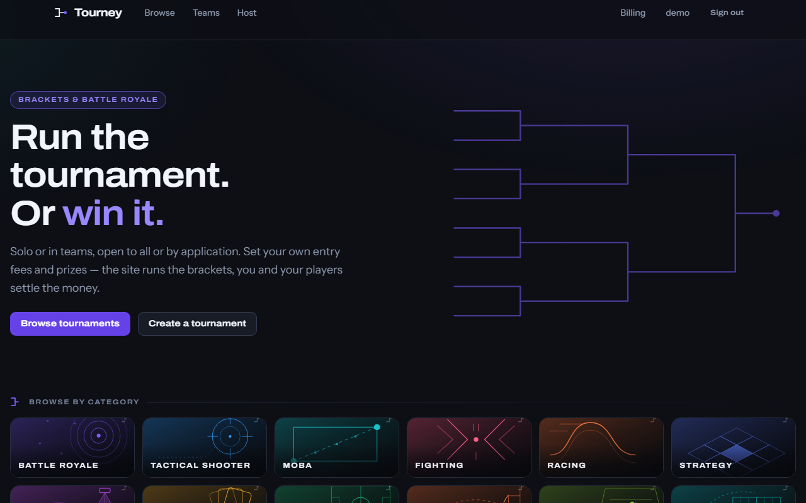
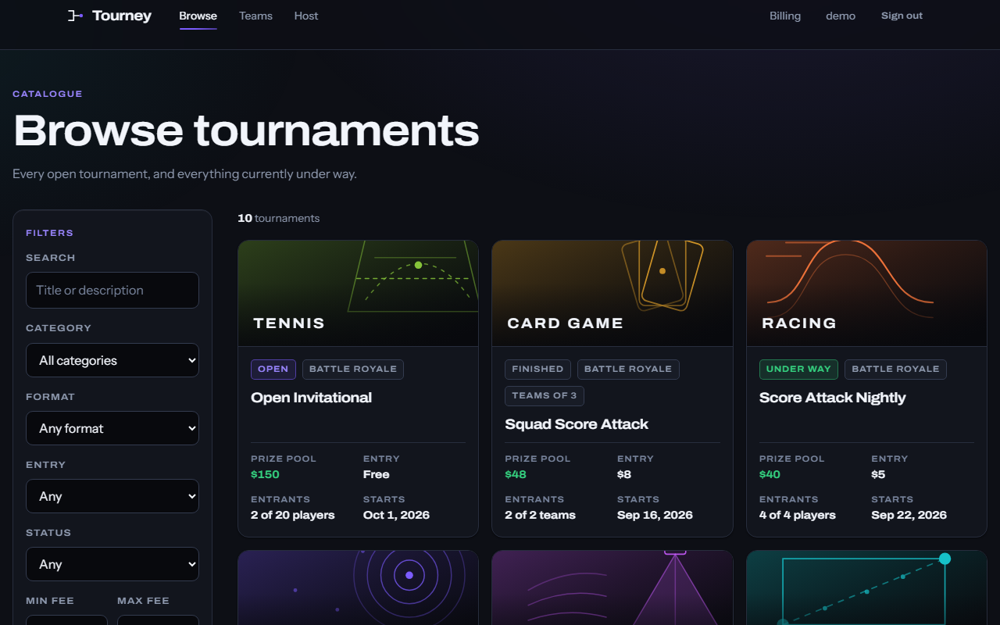
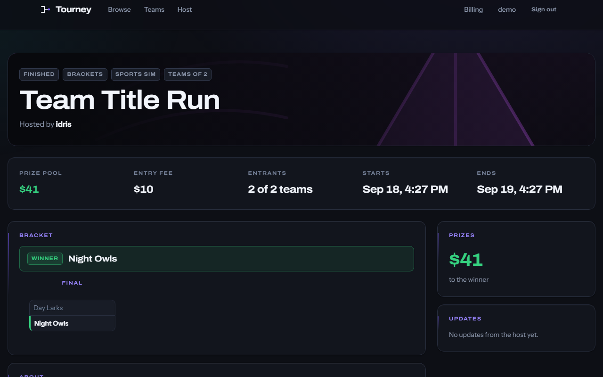
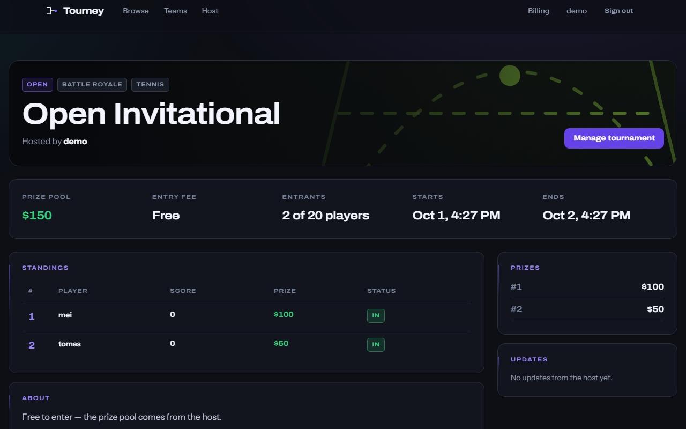
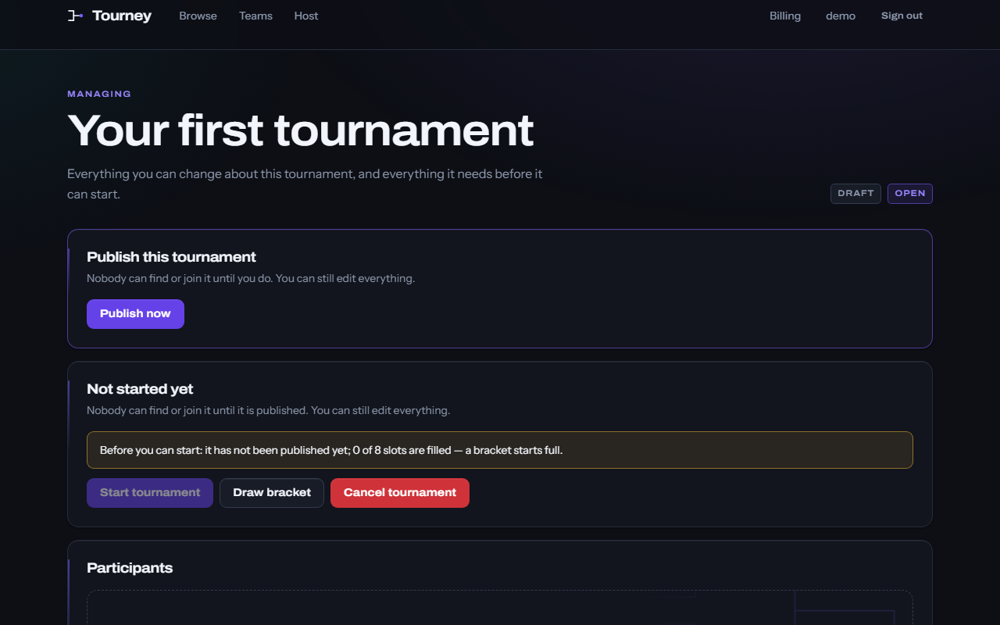
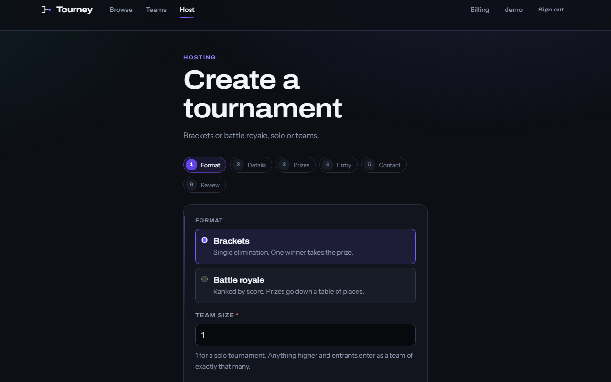
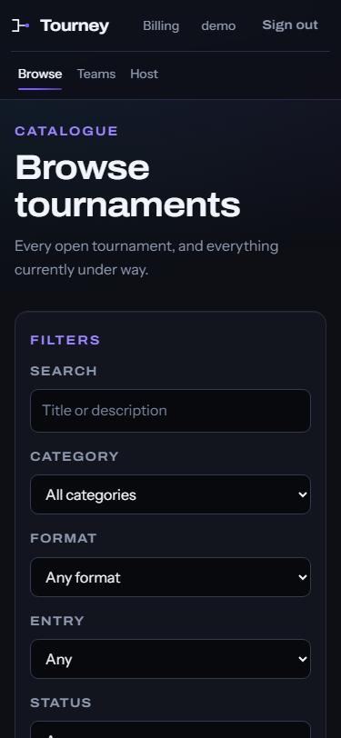

<div align="center">

<picture>
  <source media="(prefers-color-scheme: dark)" srcset="client/public/brand/tourney-logo-dark.svg">
  <source media="(prefers-color-scheme: light)" srcset="client/public/brand/tourney-logo-light.svg">
  
</picture>

### Run the tournament. Or win it.

Host and play grassroots tournaments — single-elimination brackets and
score-ranked battle royales, solo or in teams, open-join or application-gated.

[](https://github.com/waleedhussein4/tourney/actions/workflows/ci.yml)
[](https://tourneylb.com)
[](LICENSE)


**[→ Open the live demo](https://tourneylb.com)**

> **Tourney is a demo.** The credits it runs on are not money, cannot be bought
> with money, and cannot be cashed out. The checkout is a mock-up — its card
> fields are visual only and nothing typed into them ever leaves your browser.

</div>

---

## Try it (60 seconds)

1. On the live demo, click **Use the demo account** (`demo@tourney.app` /
   `DemoPlayer2026`) instead of typing credentials.
2. Open **Your first tournament** from the profile menu.
3. Press **Publish**.

That's the whole loop — sign in, open a tournament you already host, put it
live. Everything else (brackets, teams, applications, standings) is reachable
from there.

Demo data resets daily at 04:00 UTC, so nothing you do sticks around — break
things freely.

---

## Screenshots

All below are from `docs/media/`; the same folder holds `docs/media/demo.gif`.

|                                                                    |                                                                       |
| ------------------------------------------------------------------ | --------------------------------------------------------------------- |
|                               |                         |
| **Home** — the bracket motif, and the category cards               | **Browse** — filters live in the URL, so a filtered list is shareable |
|                          |                   |
| **A bracket** — who advanced, who went out                         | **A battle royale** — score-ranked, with each rank's prize            |
|                          |                            |
| **The host console** — everything a host can change, in one screen | **Creating one** — format, details, prizes, entry, review             |

<div align="center">
  
  <br><em>Responsive down to 360px.</em>
  <br><br>
  
</div>

---

## What it does

- **Hosts and players.** Anyone can browse as a guest; signing in lets you
  enter tournaments and, for 20 credits, become a host.
- **Two formats.** Single-elimination brackets, and score-ranked battle
  royales with per-rank standings.
- **Solo or teams.** Create a team, invite by link or join code, promote a new
  leader. A team that has entered a tournament is frozen until it finishes.
- **Open-join or application-gated.** A host can let anyone in, or review and
  accept applications first.
- **Credits, entry fees and prizes.** Credits are a demo currency. Buy a
  package at the demo checkout (free, no card is read), pay 20 to become a
  host, and pay a tournament's entry fee into its **bank**. The bank must cover
  the advertised prizes before the tournament can start; on the end, prizes
  are paid out of it and whatever is left returns to the host.
- **Publishing.** A tournament is a draft only its host can see until they
  publish it. Publishing is free and instant.
- **Accounts.** Email verification on signup, self-serve password reset, and
  an account can be suspended by an admin if it's reported.
- **Match results.** Either competitor reports a score; the other confirms or
  disputes it. A dispute blocks that bracket from advancing until the host
  rules on it. Hosts can also schedule kickoff times per match.
- **Waitlists.** Joining a full tournament waitlists you instead of failing;
  a withdrawal promotes the next entry automatically.
- **Notifications.** In-app and email, with per-category preferences and a
  one-click unsubscribe link — application decisions, matches starting soon,
  results needing your confirmation, waitlist promotions.
- **Moderation.** Anyone can report a user or a tournament; admins can
  suspend accounts and unpublish or remove tournaments, and every action
  writes an audit row.
- **Host and player dashboards.** "What's next for you" (your next match,
  results awaiting confirmation, applications you're waiting on) and "what
  needs you" for hosts (open applications, disputes, reports) across
  everything they run.

---

## Run it locally

```bash
npm install
cp server/.env.example server/.env   # set MONGODB_URI to a connection string
npm run dev                          # npm run seed first to load demo data
```

Open <http://localhost:5173>. Full setup notes, including why a standalone
`mongod` won't work (the app relies on transactions), are in
[docs/SETUP.md](docs/SETUP.md).

---

## Architecture

```
Browser ──▶ React SPA (Vite) ──▶ /api/* via Vite dev proxy ──▶ Express ──▶ Mongoose ──▶ MongoDB Atlas
```

In production, client and server are served same-origin, so there's no CORS
configuration anywhere in the codebase and the auth cookie is first-party.
It's deployed on **Cloudflare**: one Worker serves the static SPA (Workers
Static Assets) and forwards `/api/*` to a Container running this same Express
app, with GitHub Actions deploying on every push to `main`. Two Cron Triggers
run against it — a daily reseed of the demo data and an hourly notification
sweep. Full details in [docs/DEPLOYMENT.md](docs/DEPLOYMENT.md).

**Module anatomy** — each server module is four files:
`*.routes.js` (zod validation) → `*.controller.js` (shapes the response) →
`*.service.js` (rules, transactions) → `*.schemas.js`. The client mirrors this
with one folder per feature: page + styles + queries.

- **Client state** is server state fetched through TanStack Query
  (`useQuery`/`useMutation` + cache invalidation) — no manual refetching, no
  full-page reloads.
- **Styling** is CSS Modules over a shared token sheet; see
  [docs/DESIGN.md](docs/DESIGN.md).
- **Tests** run against a real MongoDB replica set via
  `mongodb-memory-server`, not mocks.
- **CI** (`.github/workflows/ci.yml`) runs lint, the regression gates, the
  test suite, and a client build on every PR.

---

## Credits, and why there are no real payments

Every credit movement is a Mongoose transaction that writes a `Transaction`
ledger row alongside it: the demo checkout grants credits, the host upgrade
burns 20, entry fees move from player to bank, payouts and refunds move back.
`server/tests/conservation.test.js` proves the total across wallets and banks
is exactly what the checkout granted minus what the host upgrade burned, and
that the ledger reconstructs every balance to the credit.

The checkout is a **demo**. Its card fields are validated for realism and
then discarded; the purchase request carries no body, so there is nothing to
leak. An earlier version of this project charged real money through a payment
provider. That was abandoned, and the reasons are in
[docs/DECISIONS.md](docs/DECISIONS.md).

---

## Testing

`npm test` runs the server suite (**342 tests**, vitest + supertest, against
a real in-memory MongoDB replica set) and the client suite (**33 tests**,
vitest + Testing Library). Server coverage includes auth and password
reset/email verification, free publishing, credit conservation through
checkout, entry fees, the waitlist, withdrawals and payouts, the full bracket and battle-royale lifecycle (including waitlists, disputes,
and match scheduling), team membership guards, notifications and their
idempotency, moderation and reporting, the daily seed reset, and backup/restore.
Client coverage covers the auth forms, the create-tournament
flows, the notification bell, and both dashboards.

---

## What I'd do next

- Arabic across the whole app, not just the marketing copy.
- Swiss and double-elimination formats alongside single-elimination and
  battle royale.
- Push notifications, not just in-app and email.
- Paginated, filterable admin views for reports and moderation history —
  today's `GET /api/admin/reports` is a flat list.

---

## Licence

MIT — see [LICENSE](LICENSE).
