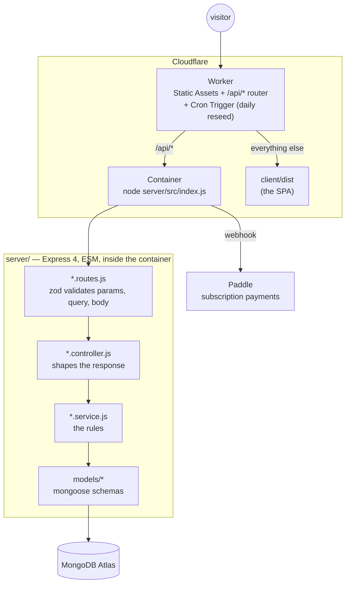

# Architecture

What this project is built out of, why, and what each choice costs. Where a
decision has a downside, it is written down — a document that only lists
advantages is a sales page, not an architecture note.

Companion documents: [API.md](API.md) for the endpoint surface,
[DESIGN.md](DESIGN.md) for the visual system, [DEPLOYMENT.md](DEPLOYMENT.md)
for how it runs in production, [DECISIONS.md](DECISIONS.md) for why the
business model is what it is today.

---

## The shape of it



Every server module is the same four files, so a request's path through the
code is the same every time. A reader who has followed one endpoint can follow
any of them.

The site itself never moves money between hosts and players — it only tracks
tournaments, entrants, and standings. The only payment path in the app is its
own subscription, through Paddle. See [DECISIONS.md](DECISIONS.md) for why.

---

## Decisions

### Why a Cloudflare Container, rather than rewriting onto Workers

`worker/index.js` forwards every `/api/*` request to a Cloudflare Container
running the unmodified Express app in Docker (`Dockerfile`); `server/src/index.js`
still `listen()`s inside it exactly as it does locally.

**Why.** Two things ruled out running the API as Workers code directly:
Mongoose 8's TCP sockets need Node's `net` module in a form the Workers
runtime doesn't provide (the underlying gap is tracked upstream, e.g.
[mongoose#14613](https://github.com/Automattic/mongoose/issues/14613)), and the
Paddle webhook needs the raw request body ahead of `express.json`, which is
easiest to keep by not changing the runtime at all. A container preserves both
without touching a line of `server/src/`.

**What it cost.** A container is a long-running process again, not a
per-request function, so the tradeoffs that shaped this code — the lazily
connecting `ensureDatabase` middleware, and `db/connect.js` caching the
connection on `globalThis` — are no longer strictly required for correctness,
but they are kept: the same app object still boots identically whether a
`node server/src/index.js` process lives for a day or restarts every request,
and there is no deployment-only code path that the test suite doesn't also
exercise through supertest.

### Why one Worker instead of two origins

The client and the API are served from **one origin**. That is not a packaging
preference — three things follow from it:

- **No CORS.** With `CLIENT_URL` unset the app registers no `cors()` middleware
  at all. There is no allowlist to get wrong and no preflight round trip.
- **A first-party auth cookie.** `HttpOnly; SameSite=Lax; Secure`. Split across
  two domains it would be a third-party cookie, which Safari's tracking
  prevention and Chrome's third-party restrictions both block — sign-in would
  quietly stop working for a share of visitors, on exactly the browsers hardest
  to debug remotely.
- **One origin to resolve and negotiate TLS with**, instead of two.

The original project was two deployments and carried a CORS block in nearly
every route file to make it work.

### Why the JWT lives in an httpOnly cookie

A token in `localStorage` is readable by any script that reaches the page — one
bad dependency and the session is gone. An `httpOnly` cookie is not readable by
script at all.

**What it cost.** CSRF becomes the thing to think about instead of XSS
exfiltration. `SameSite=Lax` covers it here: the API is same-origin, and no
state-changing route is a `GET` that a cross-site form could trigger — except
the cron reseed, which answers `GET` (and `POST`, for triggering it by hand)
and requires a bearer token that a browser will never attach.

### Why UUID ids instead of Mongo's ObjectId

Every document has a `uuid` v4 as its `_id`.

**Why.** An `ObjectId` encodes a timestamp and a counter, so exposing one in a
URL leaks roughly when a record was made and lets a reader estimate how many
exist — the classic "we have 41 users" leak. UUIDs also mean the id is
generated by the application, so a service can build an object graph before
anything is written.

**What it cost.** A UUID string is 36 bytes against an ObjectId's 12, so indexes
are larger, and inserts are not naturally ordered by time. At this scale neither
matters; at a much larger one, UUIDv7 would be the answer.

### Why tournaments have no entry fee or prize fields

A tournament only records who is in and who won — no entry fee, no prize, no
prize table.

**Why.** Even a declared, off-platform entry fee and prize pool reads as a
wagering contract to a payment processor's review, which is what got this
product's Paddle application rejected. Removing the fields entirely — not just
declining to hold the money — is what got it approved. See
[DECISIONS.md](DECISIONS.md) for the fuller reasoning.

**What it cost.** The site cannot describe what a tournament is worth to
enter or to win — it is a bulletin board and a scoreboard for the event, not a
stakes tracker. That is the tradeoff for staying approved by the payment
processor.

### Why the subscription is the only payment the app takes

Hosting more than one live tournament at a time costs $5/month, taken by
Paddle as merchant of record. One call — `GET /api/billing/me` — answers both
the billing screen and whether `POST /api/tournaments/:id/publish` will
succeed, so the two can never disagree. `assertMayPublish` in
`subscriptions/subscription.service.js` is the single place that decides it.

**What it cost.** A second module (`subscriptions/`) and a webhook the rest of
the app doesn't otherwise need. Worth it for keeping "can this host publish?"
answerable in one place rather than scattered across the tournament and user
modules.

### Why React Query rather than `useEffect` + `useState`

Server state is cached and invalidated by key. A mutation invalidates what it
affected, and the components reading that key re-render.

**Why.** The original refetched by reloading the page — `navigate(0)` — after
almost every action, which threw away the whole SPA and re-authenticated on the
way back. There are now zero `navigate(0)` calls, and a grep gate in
`check:regressions` keeps it that way.

**What it cost.** Cache keys have to be right. An invalidation that names the
wrong key produces a screen that is silently stale, which is a harder bug to see
than a missing refetch.

### Why CSS Modules and a token sheet

Two layers of tokens (primitives, then semantic roles) in `styles/tokens.css`,
and a CSS Module beside every component. No runtime CSS-in-JS, no utility
framework.

**Why.** Modules mean no component can be restyled by accident from three
folders away, and the token split means retuning the palette is an edit to one
file rather than a hunt. No runtime means no style recalculation cost and
nothing extra in the bundle.

**What it cost.** Sharing a class between components takes an explicit import
rather than happening by accident — which is the point, but it is more typing.
See [DESIGN.md](DESIGN.md) for the system itself.

### Why zod at the edge

Every `params`, `query`, and `body` is parsed before a controller runs, and the
parsed value replaces the raw one.

**Why.** A controller that starts with fifteen lines of `if (!req.body.title)`
is a controller whose validation drifts from its documentation. Doing it in the
route keeps the shape declarative and next to the endpoint, and gives one error
format for every failure.

**What it cost.** Two places describe the same shape — the zod schema and the
mongoose model. They are checked against each other by the tests rather than by
a type system.

### Why plain JSX and not TypeScript

The stack was frozen at the start of the rewrite, and the original was plain
JavaScript. Converting 5,000 lines of client code to TypeScript would have been
the whole project instead of the rewrite.

**What it cost.** No compile-time guarantee that a component's props match what
its callers pass. Mitigated with JSDoc on shared components and the exported
API-layer functions, so an editor still autocompletes and still complains, but
it is a mitigation and not a type system.

### Why `components/ui/index.js` does not export everything

The barrel re-exports the small, common pieces — `Button`, `Card`, `Field` — and
deliberately leaves out `RichTextField`.

**Why.** `RichTextField` imports Quill, and Quill's stylesheet with it. A CSS
import is a side effect, so a bundler cannot prove the module is unused and
cannot drop it. Through the barrel, that made **every page that imported a
`Button` also import a 216 kB rich text editor** — which was most of the reason
the client shipped as one 889 kB chunk to every visitor.

The measurement is worth keeping, because the intuition is wrong in an
instructive way. Splitting the two routes that actually use the editor moved
almost nothing:

|                                                     | main chunk    | gzipped       |
| --------------------------------------------------- | ------------- | ------------- |
| before                                              | 889.54 kB     | 296.60 kB     |
| after lazy-loading the two host routes              | 800.57 kB     | 266.75 kB     |
| after also taking `RichTextField` out of the barrel | **334.99 kB** | **107.74 kB** |

Route splitting was worth 30 kB. The one-line barrel change was worth 159 kB.
The lazy import could not work while a static import chain still reached the
same module from the entry point.

**What it cost.** Two call sites import `RichTextField` from its own module
rather than the barrel, which is marginally less tidy. That is the whole price.

**The rule this generalises to:** a barrel file is only free when every module
behind it is side-effect free. One CSS import inside one component is enough to
pin the entire dependency to the entry chunk, silently, with no warning from
anything. When a bundle is bigger than the sum of what a page uses, look for a
barrel before looking at the routes.

### A note on measuring it

Lighthouse numbers for this app are dominated by whether the browser already
holds the JavaScript bundle, not by which page is under test.

Measured against the deployed site with a **fresh browser per run**, so every
run starts with an empty cache:

|            | first visit | repeat visit |
| ---------- | ----------- | ------------ |
| Home       | 80          | 98           |
| Browse     | 80          | 98           |
| Tournament | 78          | 98           |

Accessibility is 100 on all three either way.

The trap is measuring the three pages in sequence in one browser. They share a
bundle, so the first page downloads it and the other two do not — 359 KiB of
transfer against 2 KiB. Whichever page runs first then scores 15-20 points lower
than the two after it, _whichever page that is_, and it looks exactly like a
page-specific problem. It is not.

**A local run is not a proxy for a first visit either.** There is no real network
between the browser and the server, so Lighthouse's simulated throttling is
modelling from unrealistic inputs, and the machine is usually also running the
API and the database. It can land either side of the deployed number: on the
same build, localhost scored 66-67 where production scored 78-80. Use it to
compare two builds against each other, not to predict what a visitor sees.

The remaining first-visit cost is the render delay before the first paint: the
page is client-rendered, so the hero heading does not exist until the bundle has
downloaded, parsed and mounted. Removing that means prerendering or server
rendering the shell, which is a different architecture rather than an
optimisation, and is not worth it for this application.

---

## Layout

```
worker/index.js     the Cloudflare Worker entrypoint: routes /api/* to the container
client/            React 18 + Vite SPA
server/            Express + Mongoose API
docs/              these documents
scripts/           check-regressions.sh — grep gates for old bugs
.github/           CI: lint, regression gates, tests, build
```

### Server module anatomy

```
modules/<resource>/
  <resource>.routes.js      paths, auth middleware, zod validation
  <resource>.controller.js  request in, response out; no rules
  <resource>.schemas.js     the zod shapes
  <resource>.service.js     the rules

modules/
  auth/           signup, login, logout
  users/          me, become host
  teams/          create, join by code, roster changes
  tournaments/    create, browse, join, apply, lifecycle, results
  subscriptions/  the hosting plan, Paddle checkout, the webhook
  admin/          seed and clear demo data
  cron/           the daily reseed, bearer-token gated
  health/         GET /api/health
```

A rule lives in exactly one place: the service. Controllers do not decide who
is allowed to do what, and routes do not reach into the database. That is what
makes "where is the publish limit enforced?" answerable without searching —
it's `subscriptions/subscription.service.js`, called once, from
`tournaments/tournament.service.js`.

### Client feature anatomy

```
features/<feature>/
  <Feature>Page.jsx         the page
  <Feature>Page.module.css  its styles
  queries.js                query keys and fetchers, where a feature has many
```

`src/api/*` is the only place `fetch` is called. One module per resource, one
error shape unwrapped in one place.

---

## Testing

208 tests, run against an **in-memory MongoDB replica set** — the real
database engine, not a mock. Each test file gets its own database inside the
shared replica set, so files run in parallel without interfering.

The suites are split by what they defend:

|                         |                                                                      |
| ----------------------- | -------------------------------------------------------------------- |
| `auth`, `teams`         | the everyday paths, and their failure modes                          |
| `tournaments.guards`    | who is allowed to do what, and what the state forbids                |
| `tournaments.lifecycle` | create → join → publish → start → results                            |
| `subscriptions`         | the free-tier limit, checkout, and `PLAN_LIMIT_REACHED`              |
| `subscriptions.webhook` | a gateway event updates the plan once, and only if it isn't stale    |
| `seed`                  | the demo data is buildable, idempotent, and commits no passwords     |
| `cron`                  | the reseed's lock, including that a rejected request changes nothing |
| `backup`                | the backup/restore scripts round-trip the collections they touch     |

Alongside them, `scripts/check-regressions.sh` is a set of grep gates in CI —
one per bug the rewrite fixed. No `navigate(0)`, no `console.log`, no
`prompt`/`confirm`/`alert`, no password in `localStorage`, no payment contact
address outside `server/src/config/plans.js`, no secret in git history. They
are crude on purpose: a grep cannot be argued with, and it fails the build the
moment a fixed bug comes back.
